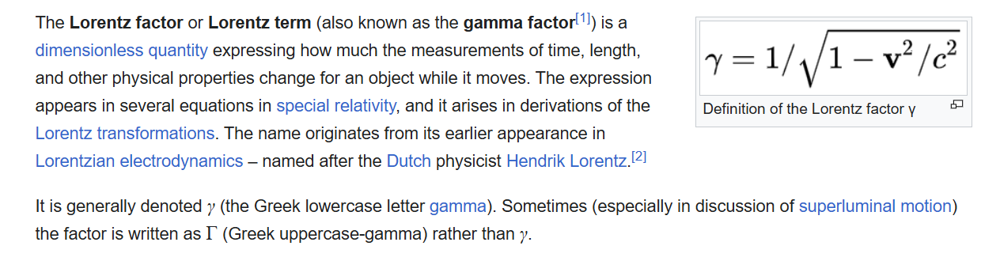

# Dilatasi Waktu


Repositori ini berisi visualisasi interaktif dari fenomena **Dilatasi Waktu** (*Time Dilation*) berdasarkan Teori Relativitas Khusus Einstein. Proyek ini awalnya adalah program C++ yang saya buat 2 tahun lalu, yang kini telah dimodernisasi dan di-*porting* ke web menggunakan **HTML**, **CSS**, dan **JavaScript** untuk memberikan pengalaman visual yang lebih intuitif.

**[🔴 LIVE DEMO](https://dilatasi-waktu.vercel.app)**


*Tampilan antarmuka simulasi yang membandingkan waktu di Bumi dan waktu bagi Astronot.*

## 📋 Daftar Isi

- [Tentang Proyek](#-tentang-proyek)
- [Konsep Fisika & Rumus](#-konsep-fisika--rumus)
- [Fitur Utama](#-fitur-utama)
- [Struktur Repositori](#-struktur-repositori)
- [Prasyarat](#-prasyarat)
- [Cara Penggunaan](#-cara-penggunaan)
- [Kontribusi](#-kontribusi)
- [Kontak](#-kontak)

## 📖 Tentang Proyek

Proyek ini bertujuan untuk mendemonstrasikan bagaimana waktu bersifat relatif, tidak absolut. Dalam fisika, semakin cepat sebuah objek bergerak mendekati kecepatan cahaya ($c$), semakin lambat waktu berjalan bagi objek tersebut dibandingkan dengan pengamat yang diam.

Aplikasi ini mengambil input jarak/waktu dari pengamat di Bumi dan kecepatan pesawat, lalu menghitung berapa banyak waktu yang berlalu bagi astronot di dalam pesawat tersebut.

**Evolusi Kode:**
* **Versi 1.0 (C++):** Program berbasis teks (CLI) sederhana untuk menghitung rumus Lorentz.
* **Versi 2.0 (Web):** Implementasi logika C++ ke dalam JavaScript dengan antarmuka grafis, animasi roket, dan visualisasi *split-screen* (Visual vs Code).

## 🧮 Konsep Fisika & Rumus



Aplikasi ini menggunakan transformasi Lorentz untuk menghitung dilatasi waktu. Rumus yang digunakan dalam kode adalah kebalikan dari faktor Lorentz untuk mencari *Proper Time* (Waktu Astronot):

$$t = t' \sqrt{1 - \frac{v^2}{c^2}}$$

**Dimana:**
* $t$ = Waktu yang dialami Astronot (dilatasi/melambat).
* $t'$ = Waktu yang dialami Pengamat di Bumi (diam).
* $v$ = Kecepatan pesawat.
* $c$ = Kecepatan cahaya ($\approx 3 \times 10^8$ m/s, atau disederhanakan menjadi 1.0c dalam simulasi).

Semakin besar $v$ mendekati $c$, maka nilai $\sqrt{1 - \frac{v^2}{c^2}}$ akan semakin kecil, menyebabkan waktu bagi astronot ($t$) berjalan jauh lebih lambat dibandingkan waktu bumi ($t'$).

🔗 **Baca lebih lanjut:**

[Wikipedia: Faktor Lorentz](https://en.wikipedia.org/wiki/Lorentz_factor)

[Wikipedia: Dilatasi Waktu](https://id.wikipedia.org/wiki/Dilatasi_waktu)

## ✨ Fitur Utama

* **Simulasi Interaktif:** Slider kecepatan ($v$) yang dapat diatur dari 0.0c hingga 1.0c.
* **Dual View:** Menampilkan animasi visual di sisi kiri dan representasi logika kode (C++) di sisi kanan.
* **Real-time Calculation:** Perhitungan selisih waktu otomatis diperbarui saat parameter diubah.
* **Visualisasi Perbedaan Waktu:** Jam analog ganda untuk membandingkan laju waktu Pengamat Bumi vs Astronot.
* **Responsive Design:** Tampilan menyesuaikan ukuran layar perangkat.

## 📂 Struktur Repositori

Direktori ini diatur agar memisahkan struktur halaman, gaya tampilan, dan logika pemrograman:

```text
/
├── style.css       # Mengatur tampilan UI
├── script.js       # Logika perhitungan fisika & manipulasi DOM
├── index.html      # Struktur utama halaman web
└── README.md       # Dokumentasi proyek
```

## 🛠 Prasyarat

Untuk menjalankan proyek ini, Anda tidak memerlukan instalasi *compiler* C++ lagi karena sudah berjalan di web. Cukup pastikan Anda memiliki:

* **Web Browser Modern** (Chrome, Firefox, Edge, atau Safari).
* **Text Editor** (VSCode, Sublime Text) *jika ingin melihat atau memodifikasi source code*.

## 🚀 Cara Penggunaan

Berikut adalah langkah-langkah untuk menjalankan simulasi di komputer lokal Anda:

1.  **Clone Repositori**
    ```bash
    git clone [https://github.com/akbar-kurnia1/dilatasi-waktu.git](https://github.com/akbar-kurnia1/dilatasi-waktu.git)
    ```

2.  **Buka Proyek**
    * Masuk ke folder hasil clone.
    * Klik dua kali file `index.html`.
    * Aplikasi akan terbuka di browser default Anda.

3.  **Interaksi**
    * **Input Jarak/Waktu:** Masukkan nilai tahun cahaya (merepresentasikan waktu bagi pengamat Bumi).
    * **Atur Kecepatan:** Geser slider untuk menentukan kecepatan pesawat (dalam persentase kecepatan cahaya, $c$).
    * **Lihat Hasil:** Perhatikan perbedaan jam antara "Pengamat Bumi" dan "Astronot" serta hasil perhitungan di panel kode sebelah kanan.

## 🤝 Kontribusi

Repositori ini terbuka untuk pengembangan. Jika Anda ingin menambahkan fitur baru:

1.  Fork repositori ini.
2.  Buat branch fitur baru (`git checkout -b fitur-grafik-baru`).
3.  Commit perubahan Anda (`git commit -m 'Menambahkan chart JS'`).
4.  Push ke branch tersebut (`git push origin fitur-grafik-baru`).
5.  Buat Pull Request.

## 👤 Kontak

**Akbar Kurniawan**

* GitHub: [@akbar-kurnia1](https://github.com/akbar-kurnia1)

---
